#✅ Taskify  
Taskify is a sleek and intuitive task management Android application that allows users to add, edit, delete, and manage their daily tasks with ease. Built with Kotlin in Android Studio, Taskify follows a clean architecture using MVVM, offering a smooth and organized experience for personal productivity with firebase for authentication.

📸 Screenshots
🏠 Splash & Home Screen

  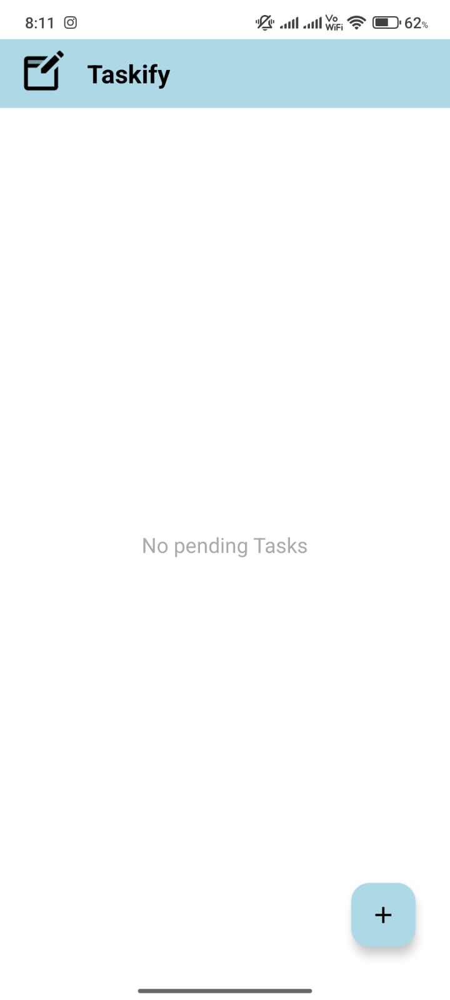 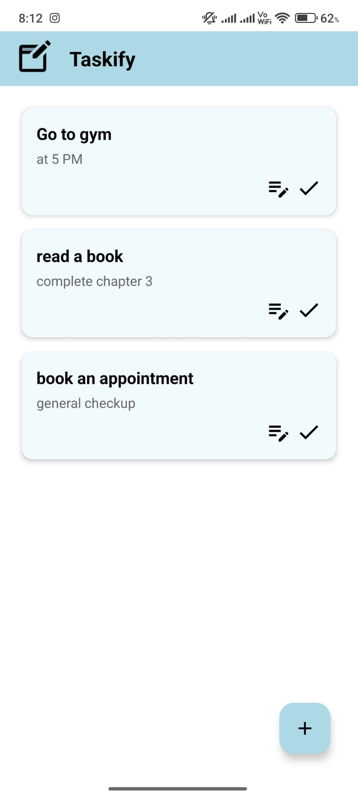 

🔐Signup Screen

 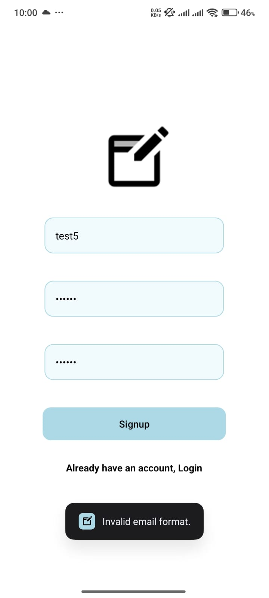 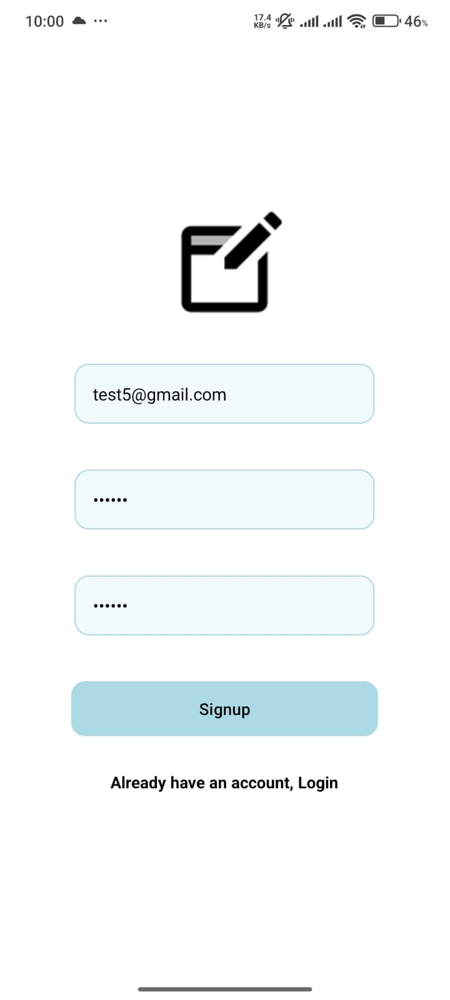  

🔓Login Screen

 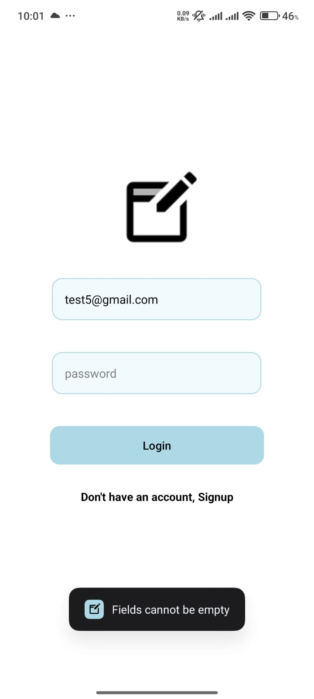 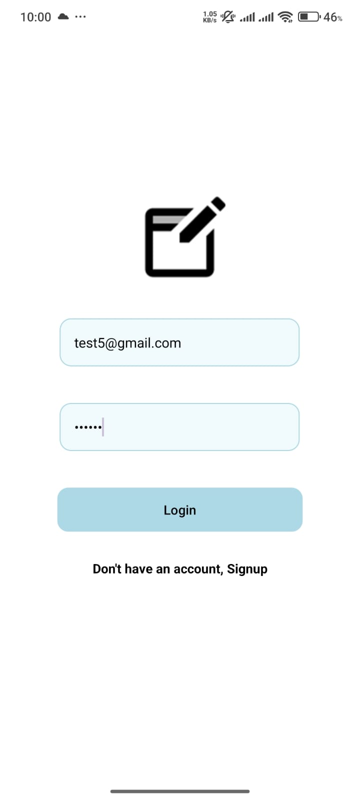 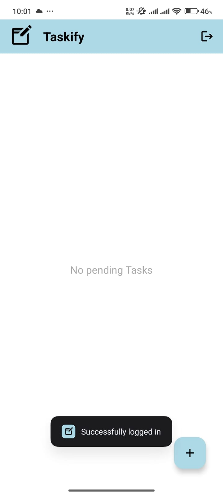 

👤➡️Logout Function

 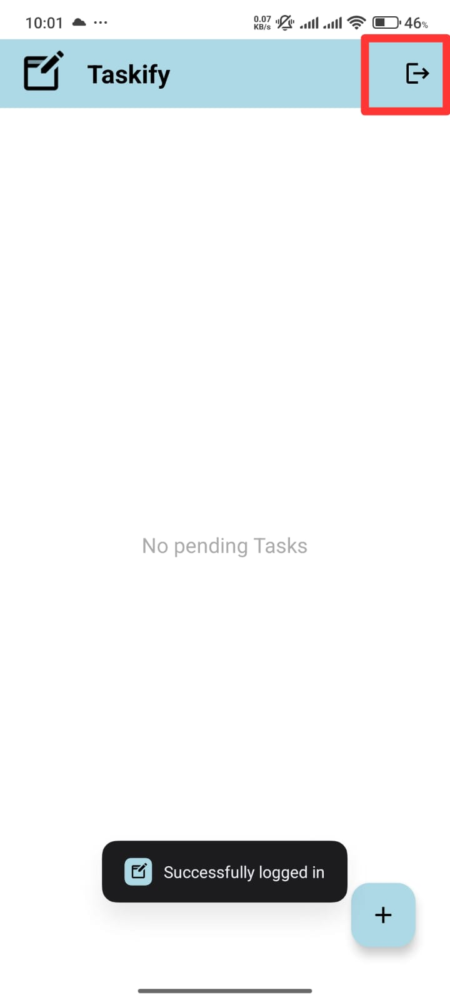 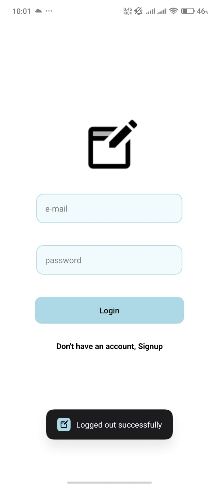 

➕ Add Task

 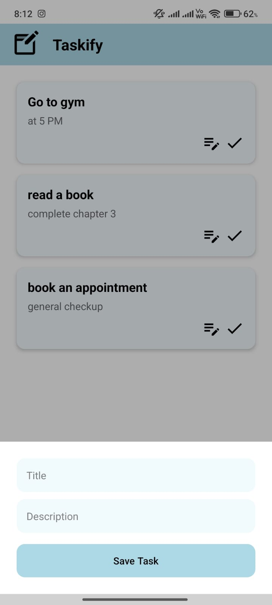 

📝 Edit Task

 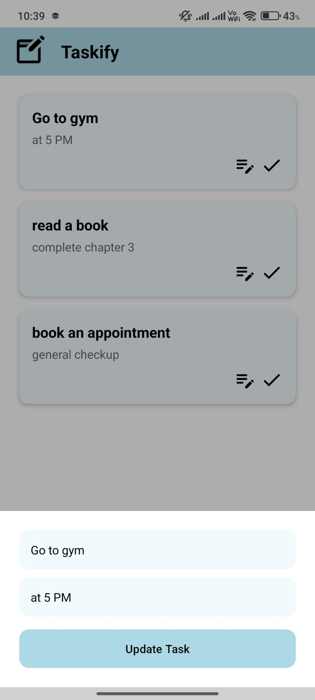 

🗂️ App Icon

 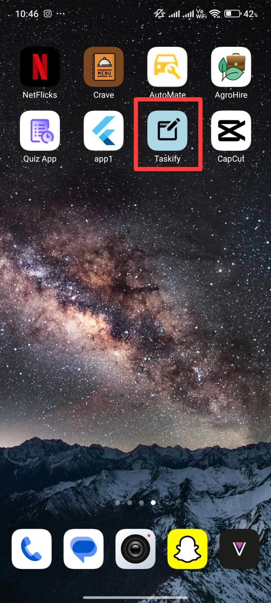 

🚀 Features
🆕 Add new tasks with title and description

✏️ Edit existing tasks

🗑️ Delete tasks with confirmation

📋 Scrollable task list with modern UI

👁️ View full task details

💾 Local data persistence using Room

📱 Clean and responsive layout using XML

💡 Splash screen with transition

🔐 Firebase Authentication Integrated
🔑 Sign up using email & password

🔐 Secure login functionality

🚪 Logout support

👤 User-based task data access

🧱 Architecture
🏛 MVVM Pattern (Model-View-ViewModel)

📦 ViewModel to manage UI-related data

🔄 LiveData and StateFlow for reactive UI updates

🧱 Room Database for local storage

🪄 RecyclerView to display task list dynamically

🔌 Firebase Authentication for user login/signup

📁 Tech Stack
Kotlin

Android Studio

Room DB

Firebase Authentication

MVVM Architecture

LiveData / StateFlow

RecyclerView
